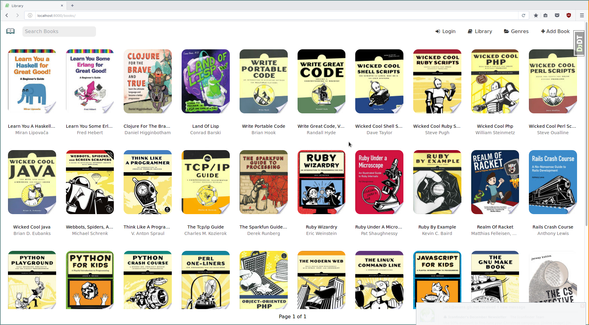

# DjangoLibrary

*Still very much WIP*

## Install Dependencies

    virtualenv -p path/to/python/installation venv
    source venv/bin/activate
    pip install -r requirements.txt

## Setup Environment

First populate the database

    python manage.py populate_db.py

In three separate terminals, run:

    celery -A DjangoLibrary beat -l info
    celery -A DjangoLibrary worker -l info
    python manage.py runserver

Then visit: [http://localhost:8000/](http://localhost:8000/)

## Screenshot

